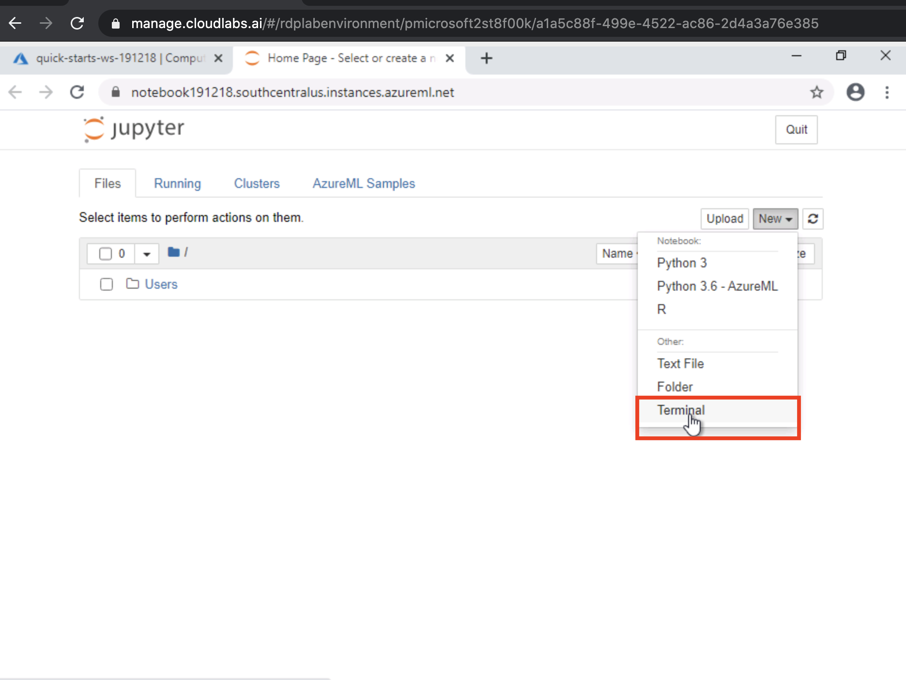
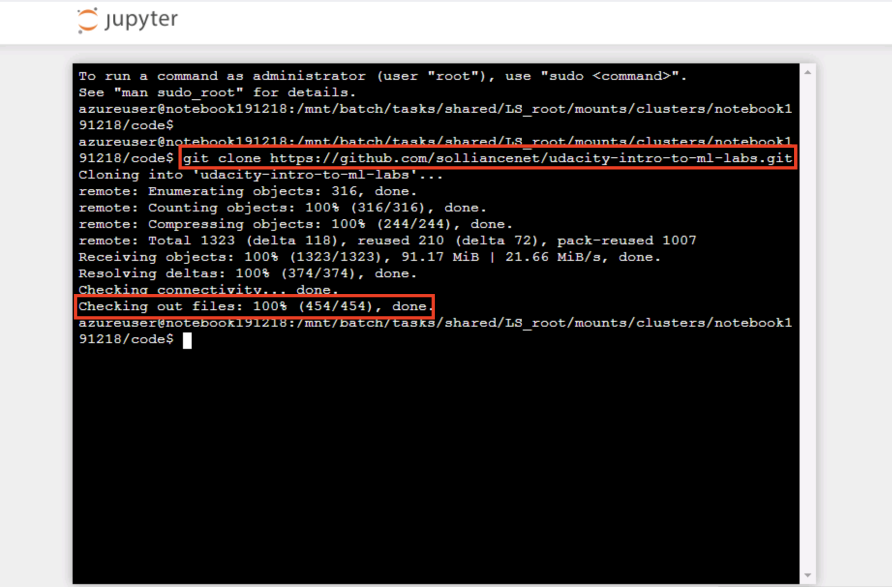
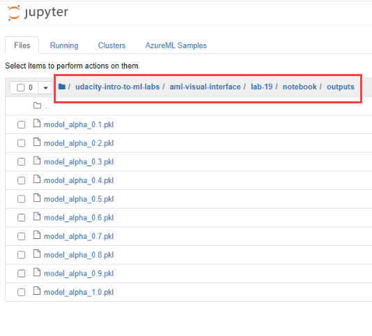

# Compute Resources

## Train a machine learning model from a managed notebook environment

So far, the Managed Services for Azure Machine Learning lesson has covered **compute instance** and the benefits it provides through its fully managed environment containing everythng you need to run Azure Machine Learning. Now it is time to gain some hands-on experience by putting a compute instance to work.

# Overview

In this lab, you learn the foundational design patterns in Azure Machine Learning, and train a simple scikit-learn model based on the diabetes data set. After completing this lab, you will have the practical knowledge of the SDK to scale up to developing more-complex experiments and workflows.

In this tutorial, you learn the following tasks:

> * Connect your workspace and create an experiment
> * Load data and train a scikit-learn model

## Exercise 1: Run the Notebook for this Lab

1. In [Azure portal](https://portal.azure.com/), open the available machine learning workspace.

2. Select **Launch now** under the **Try the new Azure Machine Learning studio** message.

    

3. When you first launch the studio, you may need to set the directory and subscription. If so, you will see this screen:

    

    > For the directory, select **Udacity** and for the subscription, select **Azure Sponsorship**. For the machine learning workspace, you may see multiple options listed. **Select any of these** (it doesn't matter which) and then click **Get started**.

4. From the studio, navigate to **Compute**. Next, for the available Compute Instance, under Application URI select `Jupyter`. Be sure to select `Jupyter` and not `JupterLab`.

   

5. From within the Jupyter interface, select **New, Terminal**.

    

6. In the new terminal window run the following command and wait for it to finish:

    `git clone https://github.com/solliancenet/udacity-intro-to-ml-labs.git`

    

7. From within the Jupyter interface, navigate to directory `udacity-intro-to-ml-labs/aml-visual-interface/lab-19/notebook` and open `1st-experiment-sdk-train-model.ipynb`. This is the Python notebook you will step through executing in this lab.

   

8. Follow the instructions within the notebook to complete the lab.

9. After completing the notebook, navigate back to the **Notebook** folder, then select the newly created **outputs** sub-folder. Here you will see the trained models (`*.pkl` files) generated by the last cell you executed. In addition, the serialized model is uploaded to each run. This allows you to download the model file from the run in the portal as an alternative to downloading them from this folder.

    

# Next Steps

Congratulations! You have just learned how to use the Jupyter application on a compute instance to train a model. You can now return to the Udacity portal to continue with the lesson.
